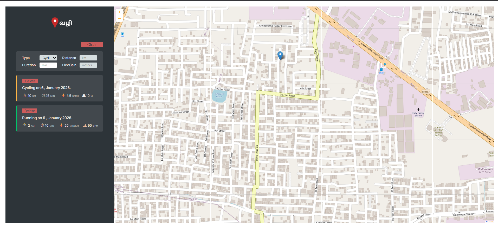

# Vazhi

Vazhi(transl. Way/Path) is a web-based fitness tracking application that allows users to log and visualize their workout activities directly on an interactive map. The application is designed to help users keep a clear history of outdoor workouts such as running and cycling by marking precise locations with map pins and storing relevant workout details.

## Features

- Add workout activities such as running and cycling
- Pin workouts on an interactive map based on location
- Store workout-specific data (e.g., distance, duration, cadence, or elevation gain)
- View all recorded workouts visually on the map
- Maintain a structured workout history for easy reference

## How It Works

1. The user selects a location on the map.
2. A workout form is displayed to enter activity details.
3. The workout is saved and represented as a pin on the map.
4. All saved workouts remain accessible for future viewing and management.

## Technology Stack

- Frontend: HTML, CSS, JavaScript
- Mapping: Interactive map library (e.g., Leaflet)
- Data Handling: Local storage in browser

## Demo Image

## License

- One can use this project for any purpose.
- One is, under any circumstances, is not prohibited from using this project for any commercial purposes.
- One is entitled to use or modify to this project.
- One cannot claim the ownership of this project.

## Credits

Udemy Course Project from [Mr. Jonas Schmedtmann](https://www.udemy.com/share/101WeY3@yTF8OXvbagXy0MhFF2oKBfSpIXV9Xn5NiaEMWLkAFw9ZQOOiaRZu1fbkrNh-A_gYzg==/)
